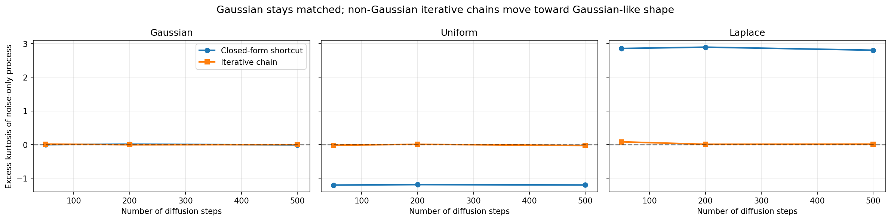
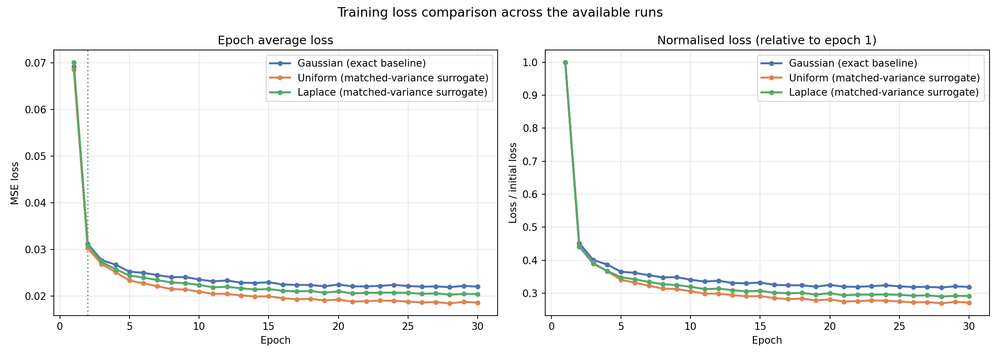
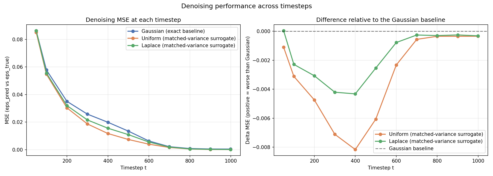
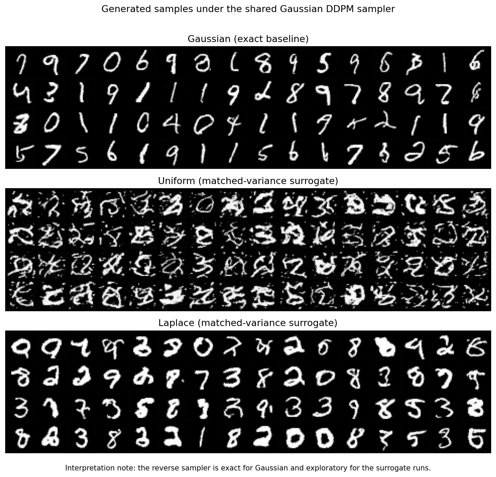
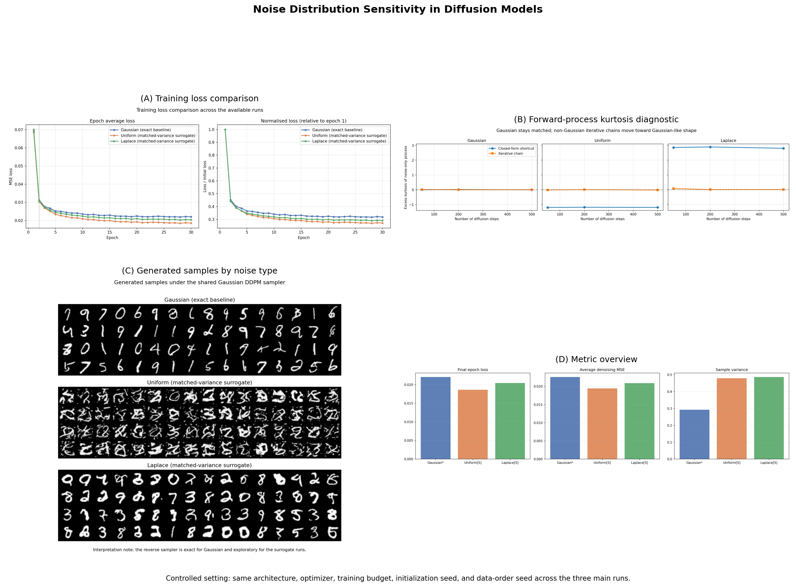

# Noise Distribution Sensitivity in Diffusion Models

## Overview

This repository studies the sensitivity of diffusion-model training and sampling to the choice of forward-process noise distribution. The experimental setting is intentionally controlled: the dataset, architecture, optimizer, schedule, random seed, and training budget are held fixed while the forward noise distribution is varied across three cases:

- Gaussian
- Uniform
- Laplace

The implementation is organized as a notebook-first workflow for Google Colab, with saved artifacts for checkpoints, logs, figures, and generated samples.

## Research Scope

The repository addresses the following question:

> How do matched-variance Gaussian, Uniform, and Laplace forward-noise choices affect denoising optimization and generated samples in a controlled DDPM-style MNIST experiment?

Two methodological distinctions are central to this study:

- The Gaussian branch is the exact DDPM baseline under the standard closed-form forward-process shortcut.
- The Uniform and Laplace branches are matched-variance surrogate direct-corruption experiments and should not be interpreted as identical forward-process laws.

All displayed generations are produced with the standard Gaussian DDPM reverse update used in the project notebooks.

## Repository Layout

```text
.
├── notebook1_setup.ipynb
├── notebook2_forward_process.ipynb
├── notebook3_architecture.ipynb
├── notebook4_training.ipynb
├── notebook5_evaluation.ipynb
├── notebook6_writeup.ipynb
├── diffusion_noise_project/
│   └── diffusion_noise_project/
│       ├── checkpoints/
│       ├── figures/
│       ├── logs/
│       ├── samples/
│       ├── tensorboard/
│       ├── config.json
│       └── unet.py
└── Original_Executed/
```

## Notebook Workflow

The recommended execution order is:

1. `notebook1_setup.ipynb`
2. `notebook2_forward_process.ipynb`
3. `notebook3_architecture.ipynb`
4. `notebook4_training.ipynb`
5. `notebook5_evaluation.ipynb`
6. `notebook6_writeup.ipynb`

The notebooks have distinct roles:

- `notebook1_setup.ipynb`: environment setup, Drive mounting, shared configuration, MNIST preview, and schedule export.
- `notebook2_forward_process.ipynb`: forward-process classes, distribution checks, corruption visualizations, and the closed-form versus iterative kurtosis diagnostic.
- `notebook3_architecture.ipynb`: compact U-Net definition used in the training and evaluation notebooks.
- `notebook4_training.ipynb`: full three-run training campaign for Gaussian, Uniform, and Laplace under shared controls.
- `notebook5_evaluation.ipynb`: loss comparison, denoising MSE evaluation, generated samples, trajectories, and summary export.
- `notebook6_writeup.ipynb`: report dashboard, artifact index, and export-oriented presentation layer.

## Experimental Protocol

The executed campaign stored in `diffusion_noise_project/diffusion_noise_project/` used the following settings:

| Item | Value |
| --- | --- |
| Dataset | MNIST |
| Image size | 28 x 28 |
| Channels | 1 |
| Forward steps `T` | 1000 |
| Beta schedule | Linear |
| `beta_start` | 1e-4 |
| `beta_end` | 0.02 |
| U-Net base width | 64 |
| Channel multipliers | `(1, 2, 4)` |
| Optimizer | AdamW |
| Learning rate | 2e-4 |
| Weight decay | 1e-4 |
| Epochs per run | 30 |
| Batch size | 256 |
| Seed | 42 |

Shared experimental controls for the three runs:

- same architecture
- same optimizer
- same training budget
- same initialization seed
- same data-order seed

## Current Artifact Record

The current experiment directory contains complete runs for all three noise types together with their evaluation summary.

| Distribution | Role | Final epoch loss | Avg denoising MSE | MSE at `t=500` | MSE at `t=999` | Sample variance | Runtime (min) |
| --- | --- | ---: | ---: | ---: | ---: | ---: | ---: |
| Gaussian | Exact DDPM baseline | 0.02204 | 0.02258 | 0.01345 | 0.00044 | 0.29293 | 23.12 |
| Uniform | Matched-variance surrogate | 0.01862 | 0.01947 | 0.00739 | 0.00010 | 0.47876 | 22.51 |
| Laplace | Matched-variance surrogate | 0.02045 | 0.02092 | 0.01091 | 0.00013 | 0.48622 | 22.54 |

These values are taken from:

- `logs/training_campaign_summary.json`
- `logs/evaluation_summary.json`

## Selected Figures

### Forward-process diagnostic

This diagnostic distinguishes the exact Gaussian closed-form shortcut from the non-Gaussian iterative chains.



### Training-loss comparison

This figure reports epoch-average loss and normalized loss under the shared training controls.



### Denoising MSE across timesteps

This evaluation summarizes epsilon-prediction error across representative timesteps and reports the deviation of the non-Gaussian runs relative to the Gaussian baseline.



### Generated samples

This panel shows the three trained models under the shared Gaussian DDPM reverse sampler used in the project notebooks.



### Summary dashboard

The final report notebook assembles a compact dashboard from the saved artifacts.



## Output Structure

The main generated outputs are organized as follows:

- `checkpoints/gaussian`, `checkpoints/uniform`, `checkpoints/laplace`: saved model checkpoints every five epochs and at the final epoch.
- `logs/*_loss.csv`: per-run training-loss logs.
- `logs/*_run_info.json`: per-run metadata and runtime record.
- `logs/training_campaign_summary.json`: campaign-wide training summary.
- `logs/evaluation_summary.json`: compact evaluation summary used by the final write-up notebook.
- `samples/*_final.png`: per-run final sample grids.
- `figures/`: exported plots and report figures.
- `tensorboard/`: per-run TensorBoard event files.

## Reproduction

The project is designed for Google Colab with Google Drive as persistent storage.

Minimal execution procedure:

1. upload or clone the repository into a Colab-accessible workspace
2. open each notebook in order
3. run all cells
4. keep the default Drive output root used by the notebooks, or edit `PROJECT_DIR` consistently across the notebook set

The current notebooks assume:

- PyTorch with CUDA support
- Google Drive mounting via Colab
- artifact persistence in `/content/drive/MyDrive/diffusion_noise_project`

## Methodological Notes

The README records the protocol used in the repository and the meaning of the saved artifacts. Three points should be kept explicit when reading the outputs:

1. The Gaussian branch is the exact DDPM baseline in this notebook implementation.
2. The Uniform and Laplace branches are matched-variance surrogate direct-corruption experiments.
3. The reverse sampling step remains Gaussian in the generated-sample sections of the notebook workflow.

## Export and Presentation

The executed notebooks can be exported directly from Colab as HTML. The final notebook also supports an optional Quarto-based export path:

```bash
quarto render notebook6_writeup.ipynb --to html
quarto render notebook6_writeup.ipynb --to pdf
```
