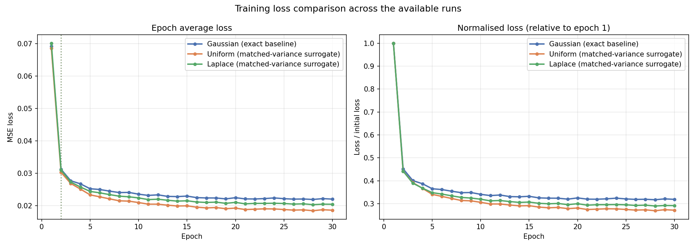
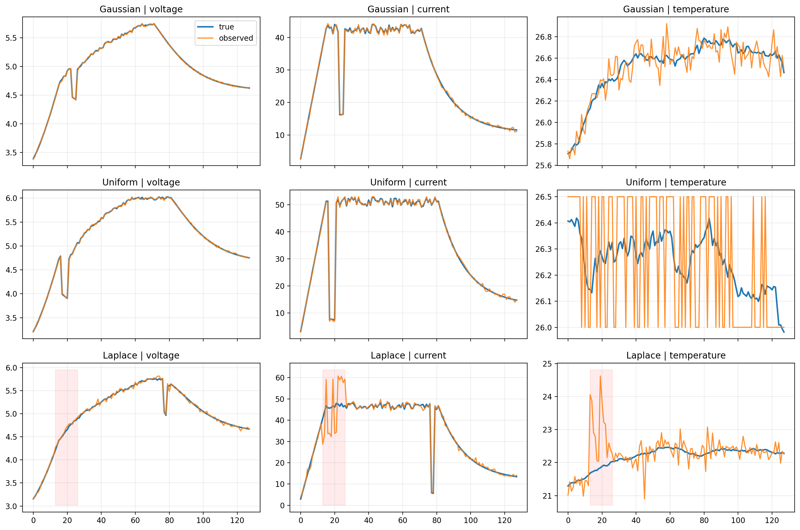
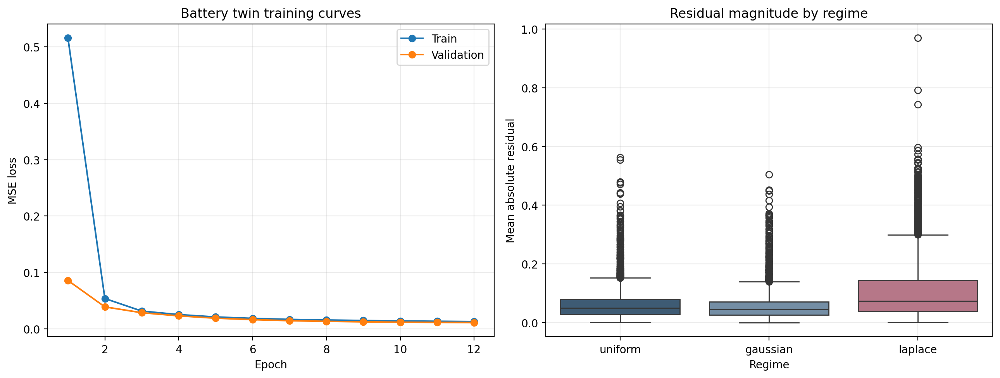
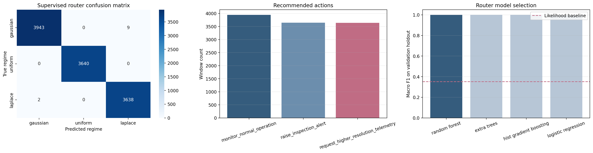
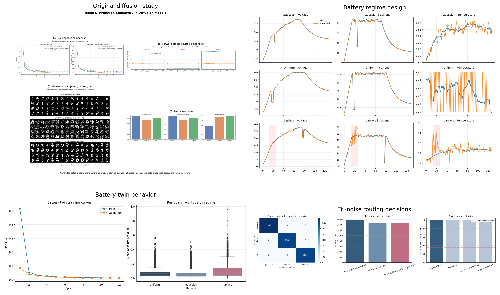

# Projet GenAI : bruits de diffusion et Battery Sentinel

## Idée générale

Ce projet est construit en deux parties qui se complètent.

La première partie étudie un point important des modèles de diffusion : le choix du bruit dans le **forward process**. Nous comparons trois familles de bruit dans un cadre contrôlé sur **MNIST** :

- **Gaussian**
- **Uniform**
- **Laplace**

La deuxième partie reprend cette idée dans un cas plus appliqué. Nous utilisons ces trois familles comme trois **régimes d'incertitude** dans un prototype de suivi batterie appelé **Battery Sentinel**.

L'objectif n'est donc pas seulement de comparer des courbes, mais de montrer qu'une idée étudiée dans un cadre génératif peut ensuite servir dans un système de décision plus concret.

## Partie 1 : étude sur les modèles de diffusion

### Question de départ

Quand on garde le même dataset, la même architecture, le même budget d'entraînement et le même planning de bruit, qu'est-ce qui change si on remplace le bruit gaussien par un bruit uniforme ou laplacien ?

### Ce que cette partie apporte

Cette première étude sert de base au projet :

- elle montre que les trois familles de bruit ne se comportent pas de la même façon ;
- elle clarifie le rôle particulier du cas **Gaussian**, qui reste la référence la plus directe dans le cadre DDPM ;
- elle fournit une lecture simple des trois régimes d'incertitude qui sera réutilisée ensuite dans Battery Sentinel.

### Résultats principaux de la partie 1

- **Gaussian** sert de baseline théorique propre ;
- **Uniform** et **Laplace** donnent des comportements différents en entraînement et en génération ;
- les écarts observés ne viennent pas seulement de la quantité de bruit, mais aussi de sa forme.

### Figures de la partie 1

#### Diagnostic méthodologique

#### Comparaison des pertes d'entraînement

#### Comparaison des échantillons générés

## Partie 2 : Battery Sentinel

### Pourquoi cette extension ?

La première partie ne sert pas seulement à comparer trois distributions. Elle donne surtout une manière simple de lire trois types d'incertitude :

- **Gaussian** : variation normale ;
- **Uniform** : mesure bornée, quantifiée ou de faible résolution ;
- **Laplace** : choc brusque, pic, anomalie impulsive.

Battery Sentinel reprend exactement cette idée dans un cas de suivi batterie.

### Principe du système

Battery Sentinel est un prototype simple en trois étapes :

1. on génère un dataset de sessions batterie simulées ;
2. on entraîne un **predictive twin** qui apprend le comportement nominal ;
3. on analyse l'écart entre prédiction et observation pour router chaque cas vers le régime le plus plausible.

Le système ne renvoie pas seulement une anomalie générale. Il indique aussi le type d'incertitude dominant et l'action associée.

### Actions renvoyées

- **monitor_normal_operation**
- **request_higher_resolution_telemetry**
- **raise_inspection_alert**

### Ce que la première partie apporte à Battery Sentinel

La partie diffusion sert directement à définir la logique de Battery Sentinel :

- la branche **Gaussian** devient le régime nominal ;
- la branche **Uniform** devient le régime de télémétrie dégradée ou quantifiée ;
- la branche **Laplace** devient le régime des événements brusques et rares.

Autrement dit, la première partie donne le langage d'incertitude utilisé par la seconde.

### Résultats principaux de Battery Sentinel

- le **dataset** simulé est équilibré entre les trois régimes ;
- le **predictive twin** apprend correctement le comportement nominal ;
- le **router** final distingue très bien les trois régimes dans ce cadre simulé ;
- la version supervisée du router améliore fortement la première version simple basée seulement sur une comparaison de scores.

### Figures de Battery Sentinel

#### Exemples de régimes simulés

#### Entraînement du predictive twin

#### Résultat du router

#### Tableau de bord final

## Organisation des notebooks

### Partie 1

- **Notebook 1** : préparation de l'environnement, du dataset et de la configuration
- **Notebook 2** : étude du forward process et des distributions de bruit
- **Notebook 3** : architecture du modèle
- **Notebook 4** : entraînement des trois expériences
- **Notebook 5** : évaluation comparative
- **Notebook 6** : synthèse finale de la première partie

### Partie 2

- **Notebook 7** : génération du dataset Battery Sentinel
- **Notebook 8** : entraînement du predictive twin
- **Notebook 9** : construction du tri-noise router
- **Notebook 10** : synthèse finale entre la partie diffusion et la partie batterie

## Comment lire le projet

Le plus simple est de le lire comme une progression logique :

1. comprendre le rôle des trois bruits dans un cadre génératif ;
2. observer leurs différences dans une étude contrôlée ;
3. réutiliser cette lecture dans un cas appliqué de monitoring batterie.

## Contenu utile du dépôt

Le dépôt contient :

- les notebooks du projet ;
- les figures générées ;
- les logs d'entraînement et d'évaluation ;
- les checkpoints du modèle de diffusion ;
- les sorties de Battery Sentinel ;

## Exécution conseillée

### Si la partie diffusion est déjà terminée

Il n'est pas nécessaire de relancer toute la première partie si les sorties sont déjà présentes.

Dans ce cas, il suffit de lancer ensuite :

- Notebook 7
- Notebook 8
- Notebook 9
- Notebook 10

### Si tout doit être refait depuis zéro

L'ordre conseillé est :

- Notebook 1 à Notebook 6
- puis Notebook 7 à Notebook 10

