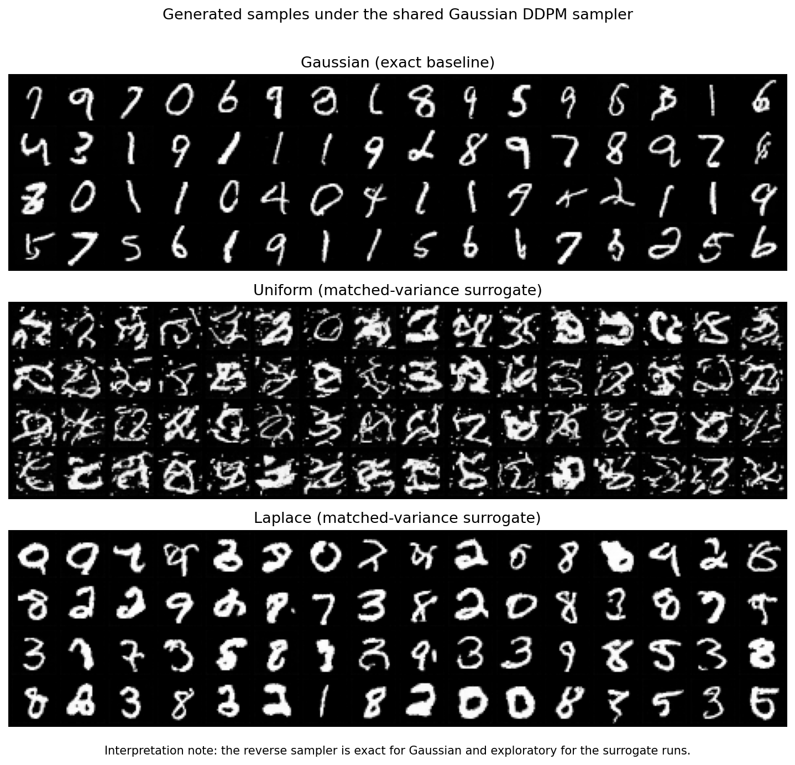

# Noise Distribution Sensitivity and Battery Sentinel

## Overview

This repository is organized as a two-layer study.

The first layer is a controlled diffusion experiment on MNIST. It examines how the forward-process noise distribution changes optimization behavior and generated samples when the rest of the DDPM-style pipeline is held fixed.

The second layer, **Battery Sentinel**, transfers the same three uncertainty regimes to a battery-monitoring setting. In that branch, Gaussian, Uniform, and Laplace are no longer treated as alternative image-generation settings only; they become three operational uncertainty modes for a diagnostic system:

- Gaussian: normal operating variation
- Uniform: bounded or quantized telemetry degradation
- Laplace: impulsive anomalous behavior

The project therefore moves from a foundational generative-model study to an applied uncertainty-routing system.

## Layer 1: Foundational Diffusion Study

### Research question

> How does the forward-process noise distribution affect denoising optimization and generated samples in a controlled DDPM-style MNIST experiment?

### Methodological framing

- The Gaussian branch is the exact DDPM baseline under the notebook implementation.
- The Uniform and Laplace branches are matched-variance surrogate direct-corruption branches.
- All displayed generations use the shared Gaussian reverse sampler implemented in the training and evaluation notebooks.

### Core notebook workflow

1. `notebook1_setup.ipynb`
2. `notebook2_forward_process.ipynb`
3. `notebook3_architecture.ipynb`
4. `notebook4_training.ipynb`
5. `notebook5_evaluation.ipynb`
6. `notebook6_writeup.ipynb`

### Roles of notebooks 1 to 6

- `notebook1_setup.ipynb`: environment setup, configuration, data loading, and schedule export.
- `notebook2_forward_process.ipynb`: forward-process construction, distribution checks, corruption visualizations, and methodological diagnostics.
- `notebook3_architecture.ipynb`: compact U-Net definition shared by the experiment.
- `notebook4_training.ipynb`: three-run training campaign for Gaussian, Uniform, and Laplace under shared controls.
- `notebook5_evaluation.ipynb`: loss comparison, denoising MSE evaluation, sample comparisons, and summary export.
- `notebook6_writeup.ipynb`: final synthesis notebook for the foundational study.

### Experimental protocol

The executed MNIST campaign stored in `diffusion_noise_project/diffusion_noise_project/` uses the following shared controls:

| Item | Value |
| --- | --- |
| Dataset | MNIST |
| Image size | 28 x 28 |
| Channels | 1 |
| Forward steps `T` | 1000 |
| Beta schedule | Linear |
| `beta_start` | `1e-4` |
| `beta_end` | `0.02` |
| U-Net base width | 64 |
| Channel multipliers | `(1, 2, 4)` |
| Optimizer | AdamW |
| Learning rate | `2e-4` |
| Weight decay | `1e-4` |
| Epochs per run | 30 |
| Batch size | 256 |
| Seed | 42 |

### Recorded artifact table

| Distribution | Role | Final epoch loss | Avg denoising MSE | MSE at `t=500` | MSE at `t=999` |
| --- | --- | ---: | ---: | ---: | ---: |
| Gaussian | Exact DDPM baseline | 0.02204 | 0.02258 | 0.01345 | 0.00044 |
| Uniform | Matched-variance surrogate | 0.01862 | 0.01947 | 0.00739 | 0.00010 |
| Laplace | Matched-variance surrogate | 0.02045 | 0.02092 | 0.01091 | 0.00013 |

### Selected figures

#### Forward-process diagnostic


#### Training-loss comparison


#### Generated samples



## Layer 2: Battery Sentinel

### System concept

Battery Sentinel is a tri-noise uncertainty-routing prototype for EV battery monitoring. It reuses the three uncertainty families established in the foundational diffusion study and maps them to a time-series diagnostic setting:

- **Gaussian regime**: nominal thermal and electrical variation
- **Uniform regime**: bounded telemetry error, coarse measurement resolution, or quantization effects
- **Laplace regime**: sparse spikes, abrupt deviations, and anomaly-like events

The objective is not only to detect abnormal behavior, but also to characterize the *type* of uncertainty that is driving the deviation.

### Applied research question

> Can the three uncertainty regimes identified in the diffusion study be reused as an interpretable routing layer for battery-behavior monitoring and anomaly triage?

### Battery Sentinel workflow

7. `notebook7_battery_sentinel_data.ipynb`
8. `notebook8_battery_sentinel_twin.ipynb`
9. `notebook9_battery_sentinel_router.ipynb`
10. `notebook10_battery_sentinel_dashboard.ipynb`

### Roles of notebooks 7 to 10

- `notebook7_battery_sentinel_data.ipynb`: synthetic battery-session generation and explicit regime design.
- `notebook8_battery_sentinel_twin.ipynb`: nominal predictive twin trained on Gaussian sessions.
- `notebook9_battery_sentinel_router.ipynb`: residual-based routing between Gaussian, Uniform, and Laplace uncertainty regimes.
- `notebook10_battery_sentinel_dashboard.ipynb`: integrated summary tying the original diffusion study to the battery-monitoring application.

### Expected outputs

After running notebooks 7 to 10, the following structure is created under `diffusion_noise_project/diffusion_noise_project/battery_sentinel/`:

- `data/`
  - `battery_sentinel_dataset.npz`
  - `battery_sentinel_metadata.csv`
- `models/`
  - `battery_twin_gru.pt`
  - `battery_twin_scalers.npz`
- `logs/`
  - `simulation_summary.json`
  - `twin_training_summary.json`
  - `twin_regime_metrics.csv`
  - `router_predictions.csv`
  - `router_metrics.json`
  - `battery_sentinel_summary.json`
- `figures/`
  - `battery_regime_examples.png`
  - `battery_twin_training_curves.png`
  - `battery_router_confusion.png`
  - `battery_router_case_studies.png`
  - `battery_sentinel_dashboard.png`

### Operational interpretation

The router outputs a regime label and a suggested operational response:

- Gaussian -> `monitor_normal_operation`
- Uniform -> `request_higher_resolution_telemetry`
- Laplace -> `raise_inspection_alert`

This transforms the project from a generative comparison into an interpretable monitoring system.

## Repository Layout

```text
.
|-- docs/
|   `-- slides.qmd
|-- notebook1_setup.ipynb
|-- notebook2_forward_process.ipynb
|-- notebook3_architecture.ipynb
|-- notebook4_training.ipynb
|-- notebook5_evaluation.ipynb
|-- notebook6_writeup.ipynb
|-- notebook7_battery_sentinel_data.ipynb
|-- notebook8_battery_sentinel_twin.ipynb
|-- notebook9_battery_sentinel_router.ipynb
|-- notebook10_battery_sentinel_dashboard.ipynb
|-- research_extension/
|-- research_extension_output/
|-- diffusion_noise_project/
|   `-- diffusion_noise_project/
|       |-- checkpoints/
|       |-- figures/
|       |-- logs/
|       |-- samples/
|       |-- tensorboard/
|       |-- battery_sentinel/
|       |-- config.json
|       `-- unet.py
`-- Original_Executed/
```

## Execution Order

### Foundational study

Run the first six notebooks in order:

1. `notebook1_setup.ipynb`
2. `notebook2_forward_process.ipynb`
3. `notebook3_architecture.ipynb`
4. `notebook4_training.ipynb`
5. `notebook5_evaluation.ipynb`
6. `notebook6_writeup.ipynb`

### Applied extension

Then run the Battery Sentinel branch:

7. `notebook7_battery_sentinel_data.ipynb`
8. `notebook8_battery_sentinel_twin.ipynb`
9. `notebook9_battery_sentinel_router.ipynb`
10. `notebook10_battery_sentinel_dashboard.ipynb`

## Local Companion Interfaces

Two optional local services are kept for browsing and presentation support:

- `:9000` = research explorer
- `:9001` = slides

Start them with:

```powershell
powershell -ExecutionPolicy Bypass -File .\start_research_stack.ps1
```

Stop them with:

```powershell
powershell -ExecutionPolicy Bypass -File .\stop_research_stack.ps1
```

## What to expect after execution

After the full workflow:

- notebooks `1` to `6` provide the controlled diffusion study and its saved artifacts;
- notebooks `7` to `10` provide a coherent applied branch that reuses the same three uncertainty regimes in a battery-monitoring system;
- `notebook10_battery_sentinel_dashboard.ipynb` acts as the bridge between the foundational study and the applied prototype.
