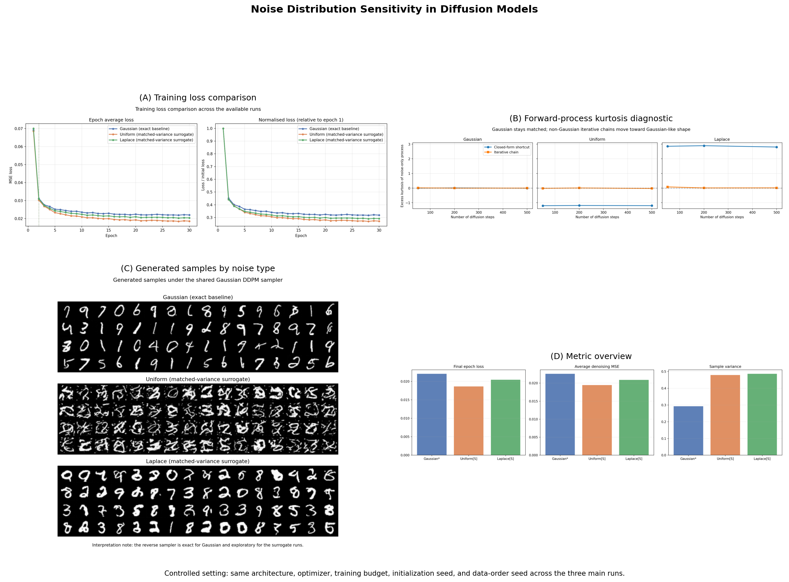
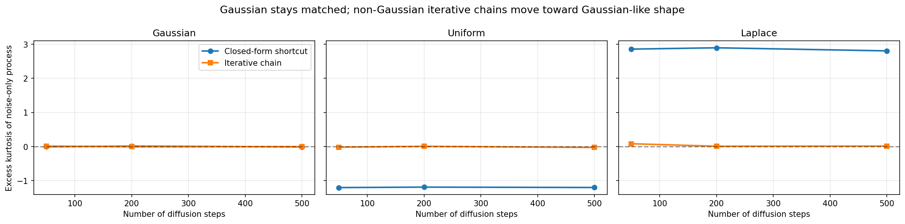

---
title: "Noise Distribution Sensitivity and Battery Sentinel"
format:
  revealjs:
    slide-number: true
    transition: fade
    theme: white
    controls: true
    progress: true
---

# Two-layer project

## Layer 1

Controlled diffusion study on MNIST

## Layer 2

Battery Sentinel: tri-noise uncertainty routing for EV battery monitoring

# Layer 1: Foundational diffusion study

## Core question

How does the forward-process noise distribution affect optimization and generated samples when the rest of the DDPM-style pipeline is held fixed?

## Controlled comparison

- Dataset: MNIST
- Shared architecture: compact U-Net
- Shared schedule, optimizer, seed, and training budget
- Three forward-noise settings:
  - Gaussian
  - Uniform
  - Laplace

## Methodological framing

- Gaussian is the exact DDPM baseline in the notebook implementation.
- Uniform and Laplace are matched-variance surrogate direct-corruption branches.
- All displayed generations use the shared Gaussian reverse sampler implemented in the notebooks.

## Foundational outputs

{fig-alt="Summary dashboard from the notebook outputs"}

## Forward-process diagnostic

{fig-alt="Kurtosis diagnostic"}

# Why extend the project?

## Key idea

The three noise families do not only define alternative generation settings.

They can also be reused as three operational uncertainty regimes:

- Gaussian: nominal variation
- Uniform: bounded or quantized telemetry degradation
- Laplace: impulsive anomaly behavior

# Layer 2: Battery Sentinel

## System objective

Route observed battery behavior toward the most plausible uncertainty regime and return an operational interpretation.

## Battery Sentinel workflow

- `notebook7_battery_sentinel_data.ipynb`
- `notebook8_battery_sentinel_twin.ipynb`
- `notebook9_battery_sentinel_router.ipynb`
- `notebook10_battery_sentinel_dashboard.ipynb`

## Expected system outputs

- synthetic battery-session dataset
- nominal predictive twin
- tri-noise router
- suggested actions:
  - monitor normal operation
  - request higher-resolution telemetry
  - raise inspection alert

## Expected artifact folder

`diffusion_noise_project/diffusion_noise_project/battery_sentinel/`

Contains:

- `data/`
- `models/`
- `logs/`
- `figures/`

# Execution order

## Run sequence

1. `notebook1_setup.ipynb`
2. `notebook2_forward_process.ipynb`
3. `notebook3_architecture.ipynb`
4. `notebook4_training.ipynb`
5. `notebook5_evaluation.ipynb`
6. `notebook6_writeup.ipynb`
7. `notebook7_battery_sentinel_data.ipynb`
8. `notebook8_battery_sentinel_twin.ipynb`
9. `notebook9_battery_sentinel_router.ipynb`
10. `notebook10_battery_sentinel_dashboard.ipynb`

# Companion interfaces

## Local services

- `:9000` = research explorer
- `:9001` = presentation slides

## Role of the final notebook

`notebook10_battery_sentinel_dashboard.ipynb` links the original diffusion study to the applied battery-monitoring prototype.
